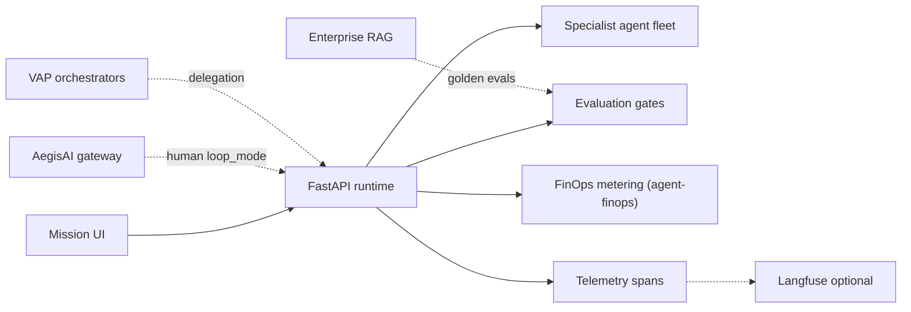

# AegisLoop AgentOps Workbench


<!-- vpeetla-tech-stack:start -->
[]() []() []() []() []() []()
<!-- vpeetla-tech-stack:end -->
## Agent skills (Cursor + Codex)

Org skills: [vpeetla-ai-skills](https://github.com/vpeetla-ai/vpeetla-ai-skills). This repo includes `.cursor/skills/`, `AGENTS.md`, and `CONTEXT.md`.

```bash
git clone https://github.com/vpeetla-ai/vpeetla-ai-skills.git
./vpeetla-ai-skills/scripts/install.sh --cursor --codex --project .
```

---

[](https://aegisloop-agentops-workbench.vercel.app)
[](https://aegisloop-api.onrender.com/health)

[▶ Live mission console](https://aegisloop-agentops-workbench.vercel.app) · [🚀 Deploy guide](docs/LIVE_DEMO.md) · [Architecture hub](docs/ARCHITECTURE.md) · [docs/ECOSYSTEM.md](docs/ECOSYSTEM.md)

AegisLoop is a production-style portfolio workbench for demonstrating orchestrated AI agent fleets: bounded missions, specialist handoffs, observable traces, evaluation gates, source coverage, and deployable runtime paths.

See [docs/ECOSYSTEM.md](docs/ECOSYSTEM.md) for how this repo connects to AegisAI, VAP, and Enterprise RAG.

**Portfolio:** [Case study](https://github.com/vpeetla-ai/ai-architecture-portfolio/blob/main/case-studies/aegisloop-agentops.md) · [Architecture](docs/ARCHITECTURE.md) · [Deploy](docs/LIVE_DEMO.md)

## Implementation Status

| Capability | Status | Notes |
| --- | --- | --- |
| 5 mission fleets (research, content, incident, migration, security) | **Implemented** | Python agents in `services/api/src/agent_loop/agents/` |
| Streaming NDJSON mission API | **Implemented** | `POST /api/missions/stream` |
| Eval gates with reasons | **Implemented** | `runtime.evaluate()` |
| Golden eval registry as a real CI gate | **Implemented** | `tests/test_golden_eval_gate.py` runs the shared `aegisloop_mission_gates_v1` suite from [golden-eval-registry](https://github.com/vpeetla-ai/golden-eval-registry) against the real `runtime.evaluate()` function — CI checks out that repo and fails the build on regression, not just fixture validation |
| Render FastAPI runtime | **Implemented** | [aegisloop-api.onrender.com](https://aegisloop-api.onrender.com/health) — cold start on free tier |
| FinOps cost estimates | **Implemented — real, not estimated** | Real token counts from Ollama/Netlify gateway responses, real cost from [agent-finops](https://github.com/vpeetla-ai/agent-finops), with a `MISSION_BUDGET_USD` guard that halts further agent dispatch on breach |
| Mission telemetry spans | **Implemented** | Attached to `artifacts.telemetry_spans` |
| Optional Langfuse export | **Implemented** | Set `LANGFUSE_PUBLIC_KEY` + `LANGFUSE_SECRET_KEY` |
| Run lineage metadata | **Implemented** | `artifacts.lineage` with `run_id` |
| Live market/content data | **Implemented** | Research + content missions in FastAPI runtime |
| Netlify serverless fleet | **Partial** | Simplified vs full Python fleet — see below |
| AegisAI gateway integration | **Implemented** | `integrations/aegis_gateway.py` |
| VAP orchestrator delegation (real A2A protocol) | **Implemented** | `VAP_DELEGATION_ENABLED` — gated on a real `GET /orchestrators/{id}/agent-card` discovery call before ever invoking `/run`, not a direct guess. See the A2A ADR in [ai-architecture-portfolio](https://github.com/vpeetla-ai/ai-architecture-portfolio) |

## Ecosystem Context

Canonical: [`docs/diagrams/canonical-architecture.mmd`](docs/diagrams/canonical-architecture.mmd)



## What Runs Where

- Frontend app folder: `app/`
- Agent runtime service: `services/api/`
- Real Python agents: `services/api/src/agent_loop/agents/`
- Orchestrator and streaming loop: `services/api/src/agent_loop/runtime.py`
- FastAPI API surface: `services/api/src/agent_loop/main.py`
- Run history store: `services/api/runs/runs.jsonl`
- `uv` package manager project: `services/api/pyproject.toml`
- Netlify AI Gateway facade: `infra/netlify/functions/mission-run.ts`
- Deployment config and scripts: `infra/`

## Local UI

```bash
cd app
python3 -m http.server 4173
```

Then open `http://localhost:4173`.

## Local Production Runtime With uv

```bash
cd services/api
uv sync
uv run agent-loop-api
```

Then select `uv FastAPI agents (real data)` in the UI. For stock-market missions, the browser prefers the streaming endpoint:

```text
POST http://localhost:8000/api/missions/stream
```

The non-streaming endpoint remains available at `POST http://localhost:8000/api/missions/run`.

## Netlify AI Gateway Deployment

The deployed endpoint is:

```text
POST /api/missions/run
```

It is implemented by `infra/netlify/functions/mission-run.ts`. On Netlify, enable AI for the site so `OPENAI_BASE_URL` is injected automatically by Netlify AI Gateway. The function uses `gpt-4o-mini` through the OpenAI-compatible gateway. If the gateway is not enabled, the function returns a deterministic local fallback so the portfolio still works.

Deploy flow:

```bash
npm install
npm run build
npm run deploy:preview
```

Use `npm run deploy:prod` for production after preview validation.

## Zero-Dollar Modes

- `Free local agents (demo fallback)`: browser-only deterministic agents.
- `uv FastAPI agents (real data)`: real Python backend agents, free/public market-data paths, no paid model required.
- `Optional Ollama localhost`: free local model if you run Ollama.
- `Netlify AI Gateway`: deployed serverless gateway. Netlify handles provider access when AI is enabled.

Use the mission UI to run:

- Bounded goal, plan, execute, verify, and ship stages
- Single orchestrator with specialist agent handoffs and real artifact passing
- Closed-loop, open-loop, and human-gated operating modes
- Evaluation gates for quality, evidence, policy, cost, latency, and stop conditions
- Memory/context, guardrails, telemetry, and replayable traces
- Today's stock market analysis, Principal AI Architect content radar, incident triage, migration planning, and security review mission flows
- Artifact tabs for final brief, structured data, replayable trace, and provider/source status

The stock-market and AI-trend missions try live data in the `uv FastAPI agents` runtime:

- Stock analysis uses Yahoo Finance quote/screener endpoints first, MarketBeat public movers pages for gainers/losers/most-active fallback, and Stooq quote fallback when available.
- Content radar uses arXiv/Hugging Face trend RSS when available.
- If live feeds are unavailable, the agents return deterministic fallback output and make that visible in the artifact/trace.
- Bloomberg and Charles Schwab are represented as provider slots but marked `not_configured` until licensed/authenticated API credentials are supplied.
- Google Finance is marked `not_configured` because it does not provide a stable official public API for this use case.

## Architecture Improvements Implemented

- Clear separation: static frontend in `app/`, Python runtime in `services/api/`, deployment assets in `infra/`.
- Backend run IDs, persisted run history, evaluation reasons, provider status, and streaming NDJSON events.
- UI review model split into Brief, Data, Trace, and Sources tabs.
- Real-data mode is auto-selected for stock-market missions when the uv API is healthy.
- Provider limitations are surfaced in the UI instead of hidden behind simulated values.
- FinOps metering (real token counts via agent-finops), mission telemetry spans, optional Langfuse export, and lineage metadata on every run.

**Netlify honesty note:** `infra/netlify/functions/mission-run.ts` is a simplified serverless fleet for portfolio deploys. For full agent coverage, live data paths, eval gates, and FinOps, use the `uv FastAPI` runtime locally or self-host `services/api/`.

The UI remains static and dependency-light, while the production runtime lives in the `uv` Python service and Netlify Function facade.

## Interview map

**Business function:** AgentOps workbench — missions, traces, eval gates, fleet monitoring.

Staff+ prep crosswalk — [playbook](https://github.com/vpeetla-ai/ai-architect-interview-playbook) · [study UI](https://ai-architect-interview-playbook.vercel.app) · [Practice Arena](https://ai-architect-practice-arena.vercel.app) · [org matrix](https://github.com/vpeetla-ai/ai-architecture-portfolio/blob/main/docs/REPO_INTERVIEW_MAP.md). Only entries this repo honestly exercises.

| Category | Entry | Fit |
|----------|-------|-----|
| System design | [LLM eval & observability](https://ai-architect-interview-playbook.vercel.app/q/ai-system-design/07-llm-evaluation-observability-platform/) ([md](https://github.com/vpeetla-ai/ai-architect-interview-playbook/blob/main/ai-system-design/07-llm-evaluation-observability-platform.md)) | Primary — traces, mission quality gates |
| System design | [Agent orchestration](https://ai-architect-interview-playbook.vercel.app/q/ai-system-design/03-agent-tool-use-orchestration-platform/) ([md](https://github.com/vpeetla-ai/ai-architect-interview-playbook/blob/main/ai-system-design/03-agent-tool-use-orchestration-platform.md)) | Mission invoke / VAP A2A delegation |
| Trade-offs | [Cost vs latency vs safety](https://ai-architect-interview-playbook.vercel.app/q/scalability-governance-tradeoffs/01-cost-vs-latency-vs-safety/) ([md](https://github.com/vpeetla-ai/ai-architect-interview-playbook/blob/main/scalability-governance-tradeoffs/01-cost-vs-latency-vs-safety.md)) | Meters via agent-finops; eval before promote |

