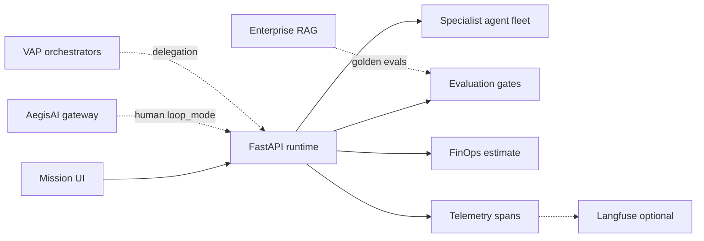

# AegisLoop AgentOps Workbench — Architecture Hub

**Role in portfolio:** AgentOps layer — bounded missions, specialist fleets, eval gates, FinOps estimates, and observable traces.

**Live demo:** [aegisloop-agentops-workbench.vercel.app](https://aegisloop-agentops-workbench.vercel.app)  
**Related:** [ECOSYSTEM.md](ECOSYSTEM.md) · [LIVE_DEMO.md](LIVE_DEMO.md)

---

## System context



---

## Runtime layout

| Layer | Path | Responsibility |
|-------|------|----------------|
| Frontend | `app/` | Mission console, streaming NDJSON UI |
| API | `services/api/src/agent_loop/main.py` | HTTP surface |
| Orchestrator | `services/api/src/agent_loop/runtime.py` | Mission loop, specialist handoffs |
| Agents | `services/api/src/agent_loop/agents/` | 5 mission fleets |
| Integrations | `services/api/src/agent_loop/integrations/` | AegisAI gateway, VAP delegation |
| Eval | `runtime.evaluate()` | Grounding, evidence, policy gates |

---

## Mission flow

```text
POST /api/missions/stream
  → Select fleet (research | content | incident | migration | security)
  → Specialist agents execute with bounded steps
  → runtime.evaluate() — pass/fail + reasons
  → FinOps cost estimate (gateway mode)
  → artifacts: telemetry_spans, lineage, outputs
  → Optional Langfuse export
```

---

## Governance integration

| Side effect | Control |
|-------------|---------|
| Destructive / notify tools | `integrations/aegis_gateway.py` |
| Human approval | Gateway `loop_mode` + mission pause |
| VAP delegation | `VAP_DELEGATION_ENABLED` routes to orchestrators |

---

## Observability

| Signal | Where |
|--------|-------|
| Mission spans | `artifacts.telemetry_spans` |
| Run lineage | `artifacts.lineage.run_id` |
| Langfuse | `LANGFUSE_PUBLIC_KEY` + `LANGFUSE_SECRET_KEY` |
| Eval reasons | Attached to mission result payload |

---

## Deployment modes

| Mode | Fidelity | Notes |
|------|----------|-------|
| **FastAPI (primary)** | Full Python fleet | Render / local |
| **Netlify serverless** | Simplified fleet | Demo fallback — see README |

---

## Implementation status

| Capability | Status |
|------------|--------|
| 5 mission fleets | ✅ |
| Streaming NDJSON API | ✅ |
| Eval gates with reasons | ✅ |
| FinOps cost estimates | ✅ |
| Mission telemetry spans | ✅ |
| Optional Langfuse export | ✅ |
| Run lineage metadata | ✅ |
| AegisAI gateway integration | ✅ |
| VAP orchestrator delegation | ✅ |
| Netlify parity with Python fleet | 🟡 Partial |

---

## Related repositories

- [aegisai-enterprise-agent-platform](https://github.com/vpeetla-ai/aegisai-enterprise-agent-platform) — governance
- [venkat-ai-platform](https://github.com/vpeetla-ai/venkat-ai-platform) — orchestration
- [enterprise_rag_platform](https://github.com/vpeetla-ai/enterprise_rag_platform) — knowledge + golden evals
- [ai-content-factory](https://github.com/vpeetla-ai/ai-content-factory) — content automation
