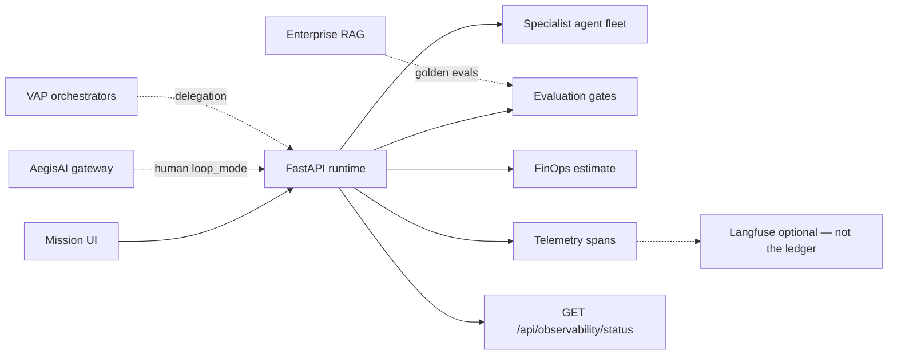
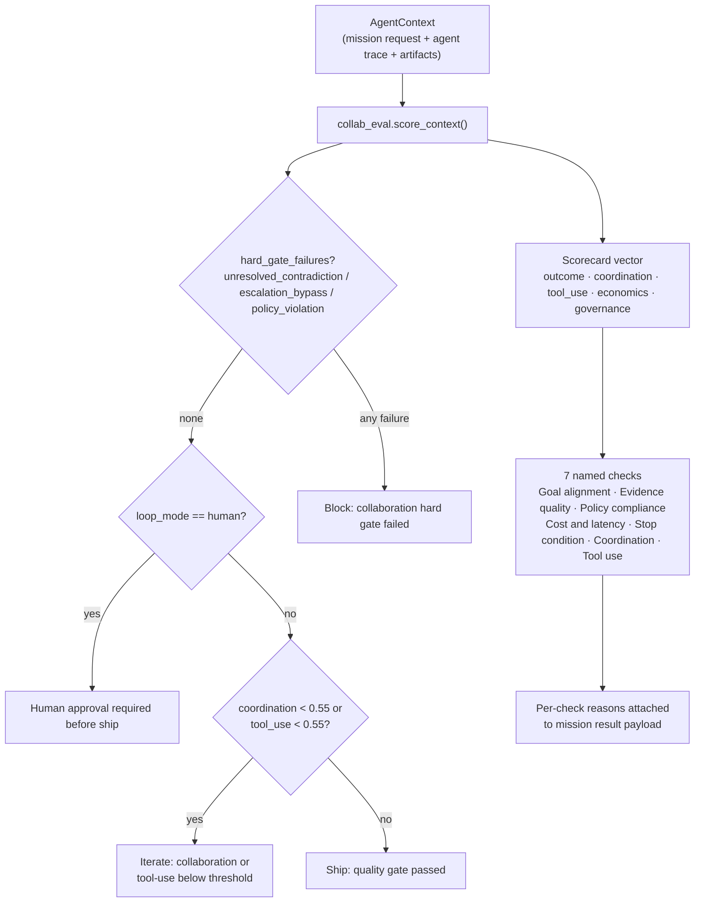

# AegisLoop AgentOps Workbench — Architecture Hub

**Role in portfolio:** AgentOps layer — bounded missions, specialist fleets, eval gates, FinOps estimates, and observable traces.

**Live demo:** [aegisloop-agentops-workbench.vercel.app](https://aegisloop-agentops-workbench.vercel.app)  
**Related:** [ECOSYSTEM.md](ECOSYSTEM.md) · [LIVE_DEMO.md](LIVE_DEMO.md)

---

## System context



---

## Runtime layout

| Layer | Path | Responsibility |
|-------|------|----------------|
| Frontend | `app/` | Mission console, streaming NDJSON UI |
| API | `services/api/src/agent_loop/main.py` | HTTP surface |
| Orchestrator | `services/api/src/agent_loop/runtime.py` | Mission loop, specialist handoffs |
| Agents | `services/api/src/agent_loop/agents/` | 5 mission fleets |
| Integrations | `services/api/src/agent_loop/integrations/` | AegisAI gateway, VAP delegation |
| Eval | `runtime.evaluate()` | 7-check gate (goal alignment, evidence, policy, cost/latency, stop condition, coordination, tool use) driven by a collaboration scorecard vector + hard gates |

---

## Mission flow

```text
POST /api/missions/stream
  → Select fleet (research | content | incident | migration | security)
  → Specialist agents execute with bounded steps
  → runtime.evaluate() — pass/fail + reasons
  → FinOps cost estimate (gateway mode)
  → artifacts: telemetry_spans, lineage, outputs
  → Optional Langfuse export
```

---

## Mission-gate pattern (origin implementation)

`runtime.evaluate()` is the **origin implementation** of the "mission gate" pattern that the rest of the vpeetla-ai org now copies. It is not trace-length theater: it runs a five-dimensional collaboration scorecard (outcome, coordination, tool_use, economics, governance — CSS/TUE-derived) through `collab_eval.score_context()`, which prefers `golden_eval_registry.scorecard` when that sibling repo is installed and falls back to a local, algorithm-synced copy (`agent_loop/scorecard_local.py`) otherwise. The scorecard's **hard-gate failures** (`unresolved_contradiction`, `escalation_bypass`, `policy_violation`) can block a ship decision outright, independent of the numeric quality score.



This exact `evaluate()` contract is what `tests/test_golden_eval_gate.py` runs the shared `aegisloop_mission_gates_v1` golden-eval-registry suite against in CI (checkout + real function call, not fixture validation only — see `.github/workflows/ci.yml`). Per [golden-eval-registry](https://github.com/vpeetla-ai/golden-eval-registry)'s own pattern index:

- **`mission_gate`** pattern — this repo is the origin; `multi-agent-system-pattern` also implements it against the shared suite.
- **`collaboration_scorecard`** pattern (CSS/TUE vector + hard gates) — this repo builds the live trajectories that the registry's suite self-scores against.

Other org pattern-repos (`react-agent-pattern`, `reflection-agent-pattern`, `plan-execute-agent-pattern`, `swarm-agent-pattern`) each copy this repo's `tests/test_golden_eval_gate.py` structure — checkout the registry in CI, run the shared suite against the repo's own real gate function, fail the build on regression — for their own pattern-specific suites (`react_agent_bounded_loop_v1`, `reflection_agent_critique_delta_v1`, `plan_execute_decomposition_v1`, `swarm_agent_fanout_v1`). This repo's version is the one to keep in sync first when the gate contract changes.

---

## Governance integration

| Side effect | Control |
|-------------|---------|
| Destructive / notify tools | `integrations/aegis_gateway.py` |
| Human approval | Gateway `loop_mode` + mission pause |
| VAP delegation | `VAP_DELEGATION_ENABLED` routes to orchestrators |

---

## Observability

Mission artifacts are the receipt I’d open first. Langfuse is optional export — not where mission pass/fail lives.

| Signal | Where |
|--------|-------|
| Mission spans | `artifacts.telemetry_spans` |
| Run lineage | `artifacts.lineage.run_id` |
| Compose honesty | `GET /api/observability/status` |
| Langfuse | `LANGFUSE_PUBLIC_KEY` + `LANGFUSE_SECRET_KEY` |
| Eval reasons | Attached to mission result payload |

Canonical pattern: [TRACE_LINKED_OBSERVABILITY](https://github.com/vpeetla-ai/ai-architecture-portfolio/blob/main/docs/TRACE_LINKED_OBSERVABILITY.md) — three levels (system / trace / node).

---

## Deployment modes

| Mode | Fidelity | Notes |
|------|----------|-------|
| **FastAPI (primary)** | Full Python fleet | Render / local |
| **Netlify serverless** | Simplified fleet | Demo fallback — see README |

---

## Implementation status

| Capability | Status |
|------------|--------|
| 5 mission fleets | ✅ |
| Streaming NDJSON API | ✅ |
| Eval gates with reasons (collaboration scorecard + hard gates) | ✅ |
| Golden eval registry as a real CI gate (org pattern origin) | ✅ |
| Multi-trial consistency gate | ✅ |
| FinOps cost estimates | ✅ |
| Mission telemetry spans | ✅ |
| Optional Langfuse export | ✅ |
| Run lineage metadata | ✅ |
| AegisAI gateway integration | ✅ |
| VAP orchestrator delegation | ✅ |
| Netlify parity with Python fleet | 🟡 Partial |

---

## Related repositories

- [aegisai-enterprise-agent-platform](https://github.com/vpeetla-ai/aegisai-enterprise-agent-platform) — governance
- [venkat-ai-platform](https://github.com/vpeetla-ai/venkat-ai-platform) — orchestration
- [enterprise_rag_platform](https://github.com/vpeetla-ai/enterprise_rag_platform) — knowledge + golden evals
- [ai-content-factory](https://github.com/vpeetla-ai/ai-content-factory) — content automation
