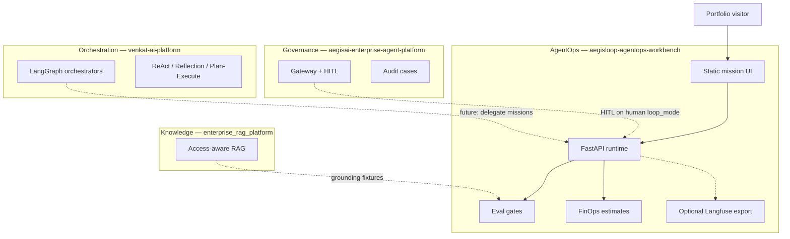

# Ecosystem — AegisLoop AgentOps Workbench

AegisLoop is the **AgentOps demonstration layer** in the Venkat AI portfolio: bounded missions, specialist fleets, evaluation gates, traces, and FinOps estimates — without replacing governance or orchestration platforms.

## Where this repo sits

## Integration map

| Capability | Owner repo | This repo's role |
| --- | --- | --- |
| Gateway HITL + registry | `aegisai-enterprise-agent-platform` | `loop_mode=human` surfaces "Human approval required"; lineage slot for `aegisai_audit_case_id` |
| LangGraph orchestration | `venkat-ai-platform` | Sequential Python fleets here are a **demo runtime**, not production orchestration |
| RAG grounding metrics | `enterprise_rag_platform` | Shares eval vocabulary; golden queries can feed mission regression |
| Content automation | `ai-content-factory` | Content radar mission demonstrates research → brief pattern |

## Runtime paths

| Path | What runs | Honest scope |
| --- | --- | --- |
| `uv FastAPI agents` | Full Python fleet in `services/api/` | **Live data** for research + content missions |
| Browser demo fallback | Deterministic JS agents | No backend; portfolio-safe |
| Netlify `mission-run.ts` | Simplified serverless fleet | **Not** feature-parity with Python runtime — documented in README |
| Ollama / AI Gateway | Optional LLM backends | FinOps estimates non-zero only for `gateway` mode |

## Implementation status (this repo)

| Area | Status |
| --- | --- |
| Mission fleets (5 types) | Implemented |
| Streaming NDJSON traces | Implemented |
| Eval gates with reasons | Implemented |
| FinOps cost estimates | Implemented (`finops.py`) |
| Mission telemetry spans | Implemented |
| Optional Langfuse export | Implemented (env-gated) |
| Run lineage metadata | Implemented (`artifacts.lineage`) |
| AegisAI gateway wire-up | **Implemented** | `integrations/aegis_gateway.py` for human `loop_mode` |
| VAP orchestrator delegation | **Implemented** | `integrations/vap_delegate.py` when `VAP_DELEGATION_ENABLED=true` |
| Netlify ↔ FastAPI proxy | **Implemented** | `AGENT_LOOP_API_URL` in `mission-run.ts` |
| API-key gate on mission-run/stream | **Implemented** | Set `AEGISLOOP_API_KEY` on both the FastAPI backend and the Netlify function — both previously had zero caller auth despite calling a real LLM; see [ai-architecture-portfolio ADR-010](https://github.com/vpeetla-ai/ai-architecture-portfolio/blob/main/adr/ADR-010-aegisloop-auth-gate.md) |

## Related repositories

- [aegisai-enterprise-agent-platform](https://github.com/vpeetla-ai/aegisai-enterprise-agent-platform)
- [venkat-ai-platform](https://github.com/vpeetla-ai/venkat-ai-platform)
- [enterprise_rag_platform](https://github.com/vpeetla-ai/enterprise_rag_platform)
- [ai-content-factory](https://github.com/vpeetla-ai/ai-content-factory)
